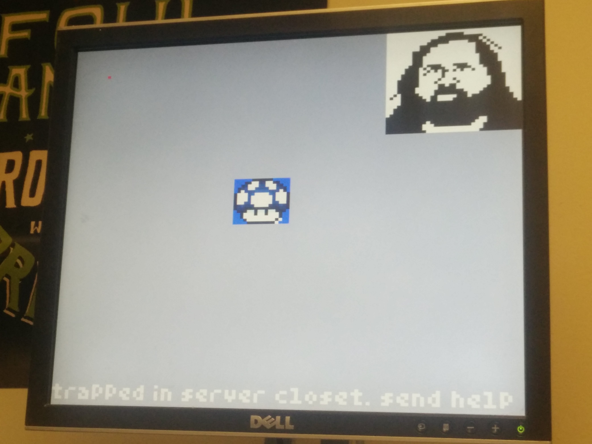

# ACM@UIUC Pixel



A 128x128 crowd-sourced display.

# Endpoints

Base API URL: [http://pixel.acm.illinois.edu](http://pixel.acm.illinois.edu).

Rate Limit: 2 requests per minute.

## POST /image/link/

Displays the image contained at the URL on the ACM@UIUC Pixel display.
Request body:

```
{
    "url": "https://farm3.staticflickr.com/2858/9370723510_a6919a15bc_b.jpg"
}
```

Response body:

```
    "status": "Success"
    "error": "Error message if applicable."
```

## POST /image/pixel/

Displays the image contained at the URL on the ACM@UIUC Pixel display.

Send a POST request to `pixel.acm.illinois.edu` with data

- `x`: 0-127
- `y`: 0-127
- `color`: #FFFFFF or a supported [color string](https://www.tcl.tk/man/tcl8.6/TkCmd/colors.htm).

Request body:

```
{
    "x": 25,
    "y": 25,
    "color": "#FF0000"
}
```

## GET /image/screenshot/regular/

Returns a regular-sized screenshot of the Pixel display, with regular size.

## GET /image/screenshot/small/

Fetches a small-sized screenshot of the Pixel display.


## Examples

cURL
```
    curl -d "x=0&y=0&color=red" -X POST pixel.acm.illinois.edu
```

python

```python
import requests
requests.post('http://pixel.acm.illinois.edu', data={'x': '0', 'y': '0', 'color': '#FF0000'})
```
